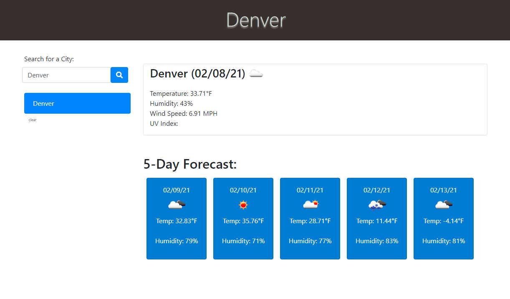
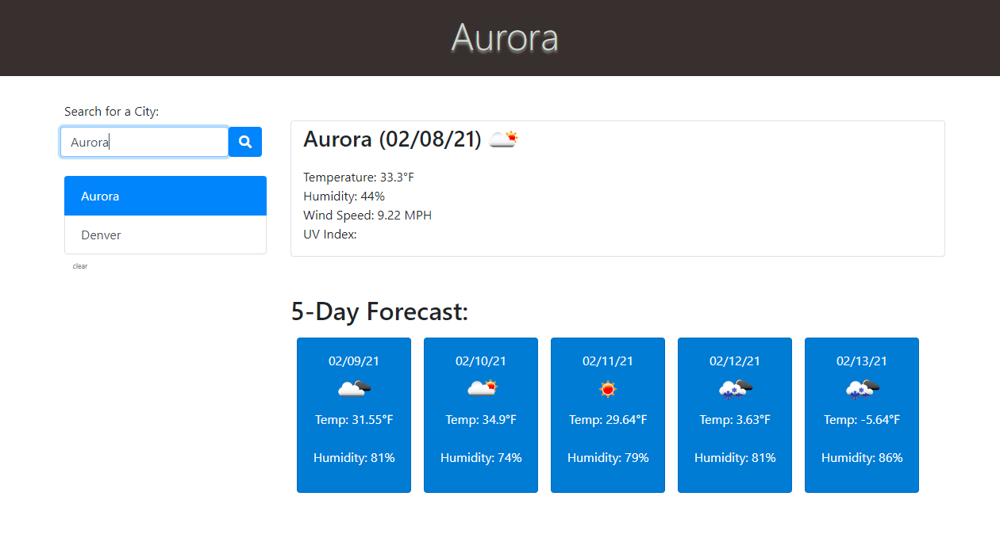
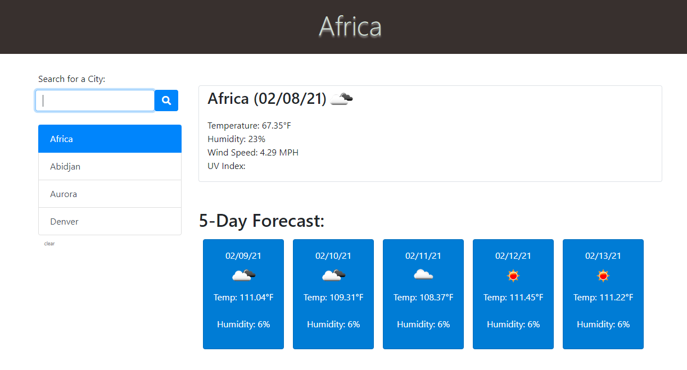

# Weather Application Using API

## Subject: Weather Dashboard 

## Description:
This Project is to build a weather dashboard that will run in the browser and feature dynamically updated HTML and CSS.
## Criteria
Using [OpenWeather API](https://openweathermap.org/api), the Project have to fulfill these criteria:
```
GIVEN a weather dashboard with form inputs
WHEN I search for a city
THEN I am presented with current and future conditions for that city and that city is added to the search history
WHEN I view current weather conditions for that city
THEN I am presented with the city name, the date, an icon representation of weather conditions, the temperature, the humidity, the wind speed, and the UV index
WHEN I view the UV index
THEN I am presented with a color that indicates whether the conditions are favorable, moderate, or severe
WHEN I view future weather conditions for that city
THEN I am presented with a 5-day forecast that displays the date, an icon representation of weather conditions, the temperature, and the humidity
WHEN I click on a city in the search history
THEN I am again presented with current and future conditions for that city
```

### See Application
[Click Here](https://lemanou7.github.io/weatherApp/) to see the application.


### Installation

<!-- GETTING STARTED -->

This is some useful steps, you must meet to run this html and css code correctly 

### Prerequisites
You can use any code editor of user choise, i use Vs Code because it is open source and it understand git and do syntax highlighting very nicely.

* Go to
  [Click Here](https://code.visualstudio.com/download) to download Vs Code to your computer.
  

1. Clone the repo
   ```sh
   git clone https://github.com/lemanou7/portfolio_work.git
   ```
2. Get a linux shell emulator like Git bash or Powershell then:
    ```sh
    cd to where your repository folder is located in your computer
    ```
3. Run the html file by entering this command if using Vs Code

   ```sh
      code index.html
   ```

4. Run the html file by entering this command if using Vs Code
   ```sh
   code index.html
   ```
   Right Click and Click on the option: "Open in Defauld Browser" or Alt B


### See Website Screenshots

5. Full Webpage 



5. Testing with the City Of Aurora



5. Testing with the Africa Continent




<!-- CONTACT -->
## Contact

Drissa Bagate (<span style="color:#5ddcf0">**Django, Javascript Full Stack Developer**</span>) [GitHub](https://github.com/lemanou7) - lemanou7@yahoo.fr

Other Project link: [My Blog Post Python-Django Implemation](http://grandbuzz.herokuapp.com/)
